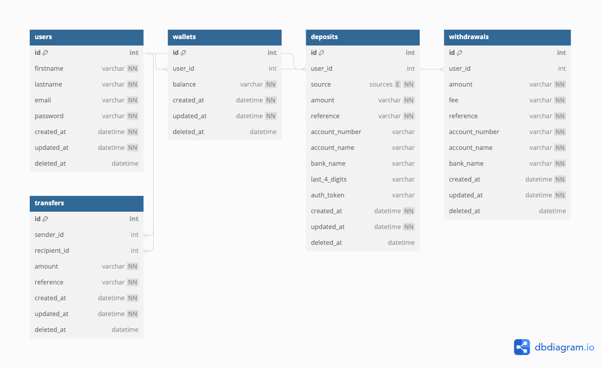

# Wallet Service API

This is scalable, performant and reliable RESTful API that allow users to perform the following operations:

* Registration of new user.
* Login of existing user.
* Create user wallet.
* Fund user wallet.
* Withdraw from user wallet
* Transfer between wallets.

### Technologies Stack

* Node.js
* Typescript.
* Expressjs.
* Supertest (testing).

### Installation

#### Step 1: Clone the repository

```shell
git clone https://gitlab.com/kora-assessment/be-ayodele-oniosun.git
```

#### Step 2: Switch to the repo folder

```shell
cd be-ayodele-oniosun
```

#### Step 3: Setup environment variable

- Copy `.env.sample` to `.env` i.e `cp .env.sample .env`
- Update all the variables as needed

#### Step 4: Dockerize app

```bash
bash setup.sh
```

## Database Schema



### API Documentation

The Postman API collection is locally available for testing [Here](./docs/postman_collection.json). <br/>

The Postman API collection is remotely
available for
testing [Here](https://documenter.getpostman.com/view/18037473/2sA3kVk1gB#6bd08934-0dc7-4775-a9d8-546295e58e51)
. <br/>

### Testing

Integration and unit tests were written for the controllers and services. <br/>

To run tests, use the following command:

```bash
docker-compose exec test_app npm run test
```

### Feedbacks on the assessment

The technical assessment is a true test of a backend engineer's expertise.
It is very comprehensive and realistic within the given timeline.

Few of other features which I would love to have implemented are accounting summary (Ledger) and transaction histories,
but time was no longer on my side.

Thanks.
